# Meridian Data Copilot

[](https://github.com/codearchitect14/governed-analytics-copilot/actions/workflows/ci.yml)


---

## Overview

Meridian Data Copilot is a governed, natural language analytics platform. Business users ask questions in plain
English and receive a verified answer: a chart or table, the exact SQL that produced it, a plain language explanation,
and an entry in a tamper-evident audit log.

Answers are resolved against a curated semantic layer wherever possible, and a language model is used only when the
question cannot be answered from that layer. Access is enforced at several independent layers, so a user sees only the
rows their role permits, including for generated SQL. The platform is built on free and open source software and
free-tier model providers.

---

## Objectives

- **Trustworthy answers.** Every figure is derived from governed metric definitions, and the generated SQL is always visible to the user.
- **Governance by design.** Role based access, row level security, column masking and an append-only audit trail are part of the core architecture, not add-ons.
- **Efficient model usage.** A token minimisation ladder answers most questions from caches and deterministic rules, and reserves language model calls for the remainder.
- **Measurable quality.** Accuracy, leakage and failure categories are measured with a repeatable evaluation harness rather than estimated.
- **Operable in practice.** A single Docker Compose stack provides the application, warehouse, orchestration and observability endpoints.

---

## What We Build

**Governance**

- Six seeded roles with data policies: executive, regional manager, category manager, seller partner, analyst and administrator.
- Row level security in the analytics schema, row scopes per user, and masking of customer identifiers for non-privileged roles.
- Argon2id password hashing, account lockout after repeated failures, short lived JWT access tokens and rotating refresh tokens with family revocation.
- A hash-chained, append-only audit log that records every query, decision and administrative action, with a verification command.

**Analytics**

- A semantic layer built on dbt and MetricFlow, with governed metrics, dimensions, a time spine and synonym vocabulary.
- A chat interface that streams its progress (resolving, planning, generating, validating, applying policy, executing, charting) and returns a chart, a table, the SQL and an explanation.
- A dashboard with five governed views whose figures reconcile with the chat answers for the same time window.
- Chat history, saved questions, answer feedback and a searchable catalog of metrics and dimensions.

**Evaluation**

- Golden question suites for pipeline accuracy, permission matrices and adversarial prompts, with checkpoint and resume, response caching and stratified sampling.
- A regression gate that fails on any data leakage or on an accuracy drop beyond the agreed margin.
- Dagster assets that orchestrate the warehouse build and evaluation runs, with a nightly regression schedule.

**Platform**

- FastAPI backend with OpenAPI documentation, rate limits per route, security headers and a request identifier on every response.
- Prometheus style metrics endpoint protected by a bearer token, and structured logs.
- React and TypeScript single page application with a public site, a role aware workspace and administration pages.
- Backup and restore scripts for the database, and a Docker Compose stack for local and test environments.

---

## How It Helps

| Audience | Benefit |
|---|---|
| Business users | Ask questions in plain English and receive answers they can check, with the SQL and an explanation attached. |
| Data and analytics teams | Define a metric once in the semantic layer and reuse it across chat, dashboards and saved questions. |
| Security and compliance | Enforce access in the database, not only in the interface, and produce a tamper-evident record of every request. |
| Engineering leaders | Track accuracy, leakage and cost with a repeatable evaluation harness and a regression gate. |
| Operators | Run the full stack from one command, back up and restore the database, and monitor requests from a metrics endpoint. |

---

## Architecture

The diagram shows the end-to-end workflow: a warehouse built from raw data, the governed API and query pipeline, the
language model gateway and the data stores. Colours identify each layer.

```mermaid
flowchart TB
    classDef client fill:#E8F1FB,stroke:#1F5FA8,stroke-width:2px,color:#0B2545
    classDef api fill:#E6F4EA,stroke:#1E7B4A,stroke-width:2px,color:#0B3D24
    classDef pipe fill:#FFF4E0,stroke:#B26A00,stroke-width:2px,color:#4A2C00
    classDef llm fill:#F3E8FF,stroke:#6B3FA0,stroke-width:2px,color:#2E1A47
    classDef data fill:#E4F6F7,stroke:#0E7C86,stroke-width:2px,color:#063B40
    classDef wh fill:#FDECEC,stroke:#A33A3A,stroke-width:2px,color:#4A1414

    subgraph CLIENT ["<b>CLIENT LAYER</b>"]
        direction LR
        USER(["<b>Business User</b><br/>Executive, Manager, Analyst"])
        WEB["<b>React Web Application</b><br/>Vite, Tailwind, ECharts"]
    end

    subgraph API ["<b>API LAYER</b> / FastAPI"]
        direction LR
        AUTH["<b>Authentication</b><br/>Argon2id, JWT access tokens<br/>rotating refresh cookies"]
        RBAC["<b>Authorization</b><br/>Role policies and row scopes"]
        LIMIT["<b>Rate Limiting</b><br/>slowapi budgets per route"]
        STREAM["<b>Chat Stream</b><br/>Server Sent Events with step states"]
    end

    subgraph PIPE ["<b>QUERY PIPELINE</b> / token minimisation ladder"]
        direction TB
        CACHE["<b>1. Caches</b><br/>Exact match, then semantic match"]
        RULE["<b>2. Rule Resolver</b><br/>Vocabulary, synonyms, time parser"]
        PLAN["<b>3. LLM Plan</b><br/>Structured metric and dimension plan"]
        SQLFB["<b>4. LLM SQL Fallback</b><br/>Single repair attempt"]
        COMP["<b>Semantic Compiler</b><br/>MetricFlow SQL"]
        GUARD["<b>SQL Guard</b><br/>Single SELECT, allow-listed relations"]
        POLICY["<b>Policy Rewrite</b><br/>Row filters and column masking"]
        EXEC["<b>Read-only Executor</b><br/>Cost ceiling, timeout, row cap"]
        OUT["<b>Answer</b><br/>Chart, SQL panel, explanation"]
    end

    subgraph LLM ["<b>LLM GATEWAY</b>"]
        direction TB
        GROQ["<b>Groq</b><br/>openai/gpt-oss-20b (primary)"]
        GEM["<b>Google Gemini</b><br/>gemini-2.5-flash (fallback)"]
        BUDGET["<b>Budgets and Circuit Breaker</b><br/>Per minute and per day limits"]
    end

    subgraph DATA ["<b>DATA LAYER</b> / PostgreSQL 16 with pgvector"]
        direction TB
        APPDB[("<b>app schema</b><br/>Users, policies, sessions<br/>Hash chained audit log")]
        MARTS[("<b>analytics schema</b><br/>Marts with row level security")]
        INDEX[("<b>Catalog index</b><br/>Metric, dimension and example embeddings")]
        CACHEDB[("<b>Cache tables</b><br/>Exact and semantic answers")]
    end

    subgraph WH ["<b>WAREHOUSE BUILD</b> / Dagster orchestrated"]
        direction TB
        RAW["<b>Olist Raw Load</b><br/>CSV files to raw schema"]
        DBT["<b>dbt</b><br/>Staging, intermediate, marts"]
        MF["<b>MetricFlow</b><br/>Semantic models and metrics"]
        EMB["<b>fastembed</b><br/>bge-small-en-v1.5, 384 dimensions"]
    end

    USER --> WEB
    WEB -- "HTTPS, bearer token" --> AUTH
    AUTH --> RBAC --> LIMIT --> STREAM
    STREAM --> CACHE
    CACHE -- "miss" --> RULE
    CACHE --> CACHEDB
    RULE -- "vector lookup" --> INDEX
    RULE -- "resolved" --> COMP
    RULE -- "unresolved" --> PLAN
    PLAN --> COMP
    PLAN -. "invalid plan" .-> SQLFB
    SQLFB --> GUARD
    COMP -- "compile" --> MF
    COMP --> GUARD
    GUARD --> POLICY --> EXEC --> OUT
    POLICY -. "scope check" .-> APPDB
    EXEC -- "read only role" --> MARTS
    OUT -- "SSE result" --> STREAM
    STREAM -- "answer" --> WEB
    OUT -- "audit event" --> APPDB
    PLAN --> GROQ
    SQLFB --> GROQ
    GROQ -. "unavailable" .-> GEM
    GROQ --> BUDGET
    GEM --> BUDGET
    RAW --> DBT --> MARTS
    DBT --> MF
    EMB --> INDEX
    MF -. "metric definitions" .-> RULE

    class USER,WEB client
    class AUTH,RBAC,LIMIT,STREAM api
    class CACHE,RULE,PLAN,SQLFB,COMP,GUARD,POLICY,EXEC,OUT pipe
    class GROQ,GEM,BUDGET llm
    class APPDB,MARTS,INDEX,CACHEDB data
    class RAW,DBT,MF,EMB wh

    style CLIENT fill:#F5F9FF,stroke:#1F5FA8,stroke-width:2px
    style API fill:#F4FBF6,stroke:#1E7B4A,stroke-width:2px
    style PIPE fill:#FFFAF0,stroke:#B26A00,stroke-width:2px
    style LLM fill:#FAF6FF,stroke:#6B3FA0,stroke-width:2px
    style DATA fill:#F2FBFB,stroke:#0E7C86,stroke-width:2px
    style WH fill:#FFF7F7,stroke:#A33A3A,stroke-width:2px
```



### Request flow

1. The user signs in. The API verifies the password, issues a short lived access token, and stores the refresh token in an httpOnly cookie.
2. Each request is authorised against the user's role and row scopes, then rate limited.
3. The question is checked against the exact and semantic caches. A cache hit returns without a model call.
4. The rule resolver maps known vocabulary to governed metrics and dimensions. Unresolved questions go to the language model for a structured plan.
5. The semantic compiler produces SQL from the governed definitions. Only when no plan is possible does the SQL fallback run, with one repair attempt.
6. The SQL guard accepts a single read-only `SELECT` against allow-listed relations, and the policy layer applies row filters and masking.
7. The read-only executor runs the query under a cost ceiling, a timeout and a row limit.
8. The answer, chart and SQL are streamed to the browser, and the request is written to the hash-chained audit log.

### Token minimisation ladder

Each question moves down the ladder only as far as necessary:

| Step | Mechanism | Model calls |
|---|---|---|
| 1 | Exact and semantic cache | None |
| 2 | Rule resolver over the governed vocabulary | None |
| 3 | Structured plan from the language model, compiled by MetricFlow | One |
| 4 | SQL fallback with one repair attempt | One or two |

### Security layers

| Layer | Control |
|---|---|
| Identity | Argon2id hashing, account lockout, short access tokens, rotating refresh tokens with reuse detection |
| Authorization | Role policies, row scopes and column masking applied before execution |
| Database | Least privilege roles, row level security in the analytics schema, read-only executor role |
| Query | SQL guard allows a single `SELECT` against approved relations; generated SQL never receives write access |
| Audit | Append-only, hash-chained log with a verification command |
| Transport | Security headers, strict CORS allow-list, request identifiers |

Details and residual risks are documented in [docs/security.md](docs/security.md).

---

## Technology Stack

| Area | Technologies |
|---|---|
| Backend | Python 3.12, FastAPI, Pydantic v2, SQLAlchemy 2, Alembic, psycopg 3, structlog, slowapi |
| Query and SQL | sqlglot, MetricFlow, dbt-core, dbt-postgres |
| Orchestration | Dagster |
| Data | PostgreSQL 16, pgvector (HNSW indexes) |
| Language models | Groq (`openai/gpt-oss-20b`), Google Gemini (`gemini-2.5-flash`) |
| Embeddings | fastembed with `BAAI/bge-small-en-v1.5` (ONNX, local) |
| Frontend | React 18, TypeScript, Vite, Tailwind CSS, React Router, TanStack Query, Zustand, Zod, ECharts |
| Testing | pytest, Hypothesis, Vitest, Testing Library |
| Delivery | Docker Compose, GitHub Actions, uv, pnpm |

---

## Getting Started

### Requirements

- Docker with Compose
- Python 3.12 and [uv](https://docs.astral.sh/uv/)
- Node.js 22.12 or later and pnpm 10.18.2
- Optional: free API keys for [Groq](https://console.groq.com) and [Google AI Studio](https://aistudio.google.com) (required for model based answers)

### Quick start

```bash
cp .env.example .env                       # then replace every change-me value
docker compose up -d --build --wait        # application, database, web and orchestration services
curl http://localhost:8010/api/v1/health   # expected: {"status":"ok","version":"0.1.0"}
```

| Service | URL | Notes |
|---|---|---|
| Web application | http://localhost:5180 | Sign in with a demo account |
| API | http://localhost:8010 | OpenAPI documentation at `/docs` |
| Orchestration | http://localhost:3010 | Dagster web interface |
| PostgreSQL | localhost:5433 | Database `copilot` |

Ports can be changed in `.env`.

### Database and demo data

```bash
make migrate       # apply database migrations (app schema, including 0006 indexes)
make seed-users    # roles, policies and demo accounts (local and test environments only)
make verify-audit  # verify the audit log hash chain
```

### Warehouse data

```bash
make data          # download the Olist dataset from Kaggle, load, then build dbt models
make data-sample   # load the committed 5,000 order sample (available once the sample is added to dataset/sample)
```

The full dataset requires Kaggle credentials, set as `KAGGLE_USERNAME` and `KAGGLE_KEY` in `.env`. Dataset terms are in
[dataset/README.md](dataset/README.md).

On Windows without `make`, run the commands in the `Makefile` directly. The scripts are Python and dbt is run from
`warehouse/dbt_project`.

---

## Demo Accounts

Demo password: `DemoOnly-Meridian-2026`. These accounts exist only in local and test environments.

| Role | Account | What to try |
|---|---|---|
| Executive | executive@meridian.example | Revenue by month, total orders, average order value. Raw SQL fallback is not available. |
| Regional manager | regional.manager@meridian.example | Revenue by customer state. Results are limited to SP, RJ, MG and ES. |
| Category manager | category.manager@meridian.example | Item level questions for two categories. The orders mart is not available. |
| Seller partner | seller.partner@meridian.example | Sales for seller S1 only. |
| Analyst | analyst@meridian.example | Ad hoc questions with SQL fallback. Customer identifiers are masked. |
| Administrator | admin@meridian.example | Users, roles, audit verification and LLM settings. Data tables are not available. |

Set `DEMO_USER_PASSWORD` to use a different demonstration password.

---

## Configuration

Configuration is read from `.env`. The most relevant variables are listed below.

| Variable | Purpose |
|---|---|
| `POSTGRES_HOST_PORT`, `POSTGRES_DB`, `POSTGRES_SUPERUSER`, `POSTGRES_SUPERUSER_PASSWORD` | Database container and superuser |
| `APP_RW_DB_PASSWORD`, `WAREHOUSE_RO_DB_PASSWORD` | Application and read-only executor role passwords |
| `JWT_SECRET` | Signing key for access tokens (at least 32 characters) |
| `GROQ_API_KEY`, `GEMINI_API_KEY` | Model provider keys |
| `LLM_CONFIG_PATH` | Provider and budget configuration (`backend/llm_config.yml`) |
| `RATE_LIMIT_LOGIN`, `RATE_LIMIT_DEFAULT` | Request budgets, for example `10/minute` |
| `METRICS_TOKEN` | Enables `/metrics` when set; requests must send `Authorization: Bearer <token>` |
| `DEMO_USER_PASSWORD` | Password for the demonstration accounts |
| `KAGGLE_USERNAME`, `KAGGLE_KEY` | Dataset download credentials |

Model provider selection is controlled from the administration area: `auto` tries Groq and then Gemini, `groq_only`
and `gemini_only` pin a provider. Per minute and per day budgets are enforced by the gateway.

---

## Evaluation

The evaluation harness runs golden suites through the production query pipeline:

| Suite | Cases committed | Measures |
|---|---|---|
| Pipeline questions | 20 | Decision and route correctness |
| Permission matrix | 10 | Decision correctness and data leakage (must be zero) |
| Adversarial prompts | 16 | Refusal correctness and leakage (must be zero) |

```bash
make eval                      # run all three suites (set EVAL_MODEL to label the run)
python scripts/publish_results.py   # write the latest summary to evals/RESULTS.md and this section
```

Runs are checkpointed after every question. An interrupted run continues with `--resume <run_id>`. Model responses are
cached by model, prompt version and question. The regression gate fails when leakage is above zero or when accuracy
drops more than three points below `evals/baseline.json`.

### Results

<!-- eval-results:start -->
No measured results are published yet. The harness requires model API keys and the full warehouse. Results will be
published here with the run date, model, prompt version and sample size.
<!-- eval-results:end -->

Known limitations: execution accuracy against gold SQL, the 150 question Olist suite, and the BIRD and Spider
benchmarks are planned but not yet implemented.

---

## Testing

```bash
make test-db                                                    # isolated test database
uv run --package governed-analytics-backend pytest backend/tests -q --cov
uv run --package governed-analytics-scripts pytest scripts/tests
pnpm --filter frontend test
```

Last full run (2026-10-06): 230 backend tests passed with 93 percent line coverage (the gate requires 80 percent),
and 31 frontend tests passed. Governance and pipeline tests run against the development stack and skip when it is
not available.

Load testing scripts are in `loadtest/k6/`. They require [k6](https://k6.io) and are not yet part of CI.

---

## Operations

```bash
make backup                                              # dump the database to backups/ with a checksum
make restore DUMP=backups/<file>.dump CONFIRM=yes        # replace the database contents from a dump
```

`/metrics` exposes request counts and latency histograms by route template when `METRICS_TOKEN` is configured.

---

## Project Structure

```
backend/            FastAPI application (app/), migrations, tests and Dockerfile
backend/app/evals/  Evaluation harness, scoring and regression gate
frontend/           React and TypeScript web application, public site and workspace
orchestration/      Dagster code location (warehouse build and evaluation assets)
warehouse/          dbt project (staging, intermediate, marts, semantic layer)
scripts/            Dataset download, load, verification and publishing scripts
dataset/            Golden suites, semantic seed data and dataset documentation
infra/              Database bootstrap, backup and restore scripts
loadtest/           Load test scenarios
docs/               Security model and design documents
.github/workflows/  Continuous integration: lint, types, tests, warehouse build, stack health, security scans
```

---

## Development

```bash
uv sync --all-packages
pnpm install
uv run ruff check . && uv run ruff format --check .
uv run --package governed-analytics-backend mypy backend/app
pnpm --filter frontend lint && pnpm --filter frontend typecheck && pnpm --filter frontend build
```

Pre-commit hooks are defined in `.pre-commit-config.yaml` (ruff, mypy, prettier, eslint, gitleaks).

---

## Project Status

| Phase | Scope | Status |
|---|---|---|
| 0 | Foundation: repository, Compose stack, continuous integration, health endpoints | Complete |
| 1 | Dataset scripts, raw load, dbt staging, intermediate and marts | Built and verified on a fixture. Full dataset run pending the Kaggle download |
| 2 | MetricFlow semantic layer, 30 plan fixtures, rule resolver, time parser, pgvector catalog index | Complete |
| 3 | Authentication, authorization, policy engine, hash-chained audit log, rate limits, security headers | Complete |
| 4 to 5 | LLM gateway, query pipeline, chat streaming | Complete |
| 6 to 7 | Governance hardening, row level security, dashboards and operations analytics | Complete |
| 8 to 9 | Public site, application workspace, administration pages | Complete |
| 10 | Evaluation harness, Dagster assets, regression gate | Harness complete. Published results pending model keys and full dataset |
| 11 | Coverage gate, metrics endpoint, pagination, query indexes, performance and backup scripts | Complete. Lighthouse, accessibility audits and load test execution pending |
| 12 | Documentation, demonstration walkthrough, release tag | In progress |

---

## Roadmap

- Publish evaluation results on the full Olist suite, BIRD Mini-Dev and Spider dev.
- Add execution accuracy against gold SQL and the error taxonomy in the evaluation page.
- Run Lighthouse, axe and load test suites in CI.
- Record the demonstration walkthrough and tag the first release.

---

## Contributing

Contributions are welcome through pull requests. Please run the linters, type checks and tests listed under
Development before opening a pull request, and keep commits in the Conventional Commits format.

## License

No license has been selected for this repository yet. Until one is added, all rights are reserved by the author.

## Dataset Attribution

The warehouse uses the Olist Brazilian E-Commerce Public Dataset (Kaggle, `olistbr/brazilian-ecommerce`), which is
published under CC BY-NC-SA 4.0. Non-commercial use and share-alike terms apply to the data. See
[dataset/README.md](dataset/README.md).
